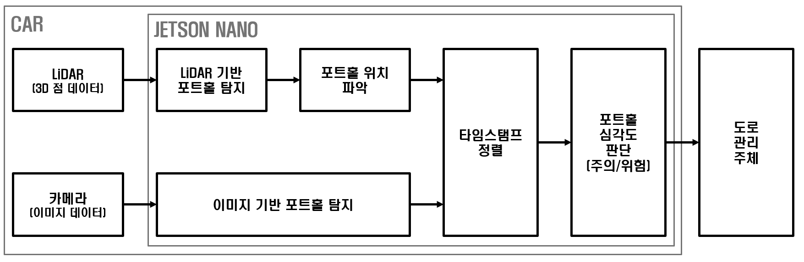

# 카메라와 LiDAR를 이용한 포트홀 탐지 및 신고 시스템

본 프로젝트는 도로 파손(포트홀)으로 인한 사고를 예방하고 지자체의 신속한 보수를 돕기 위해 개발되었습니다. **카메라의 이미지 분석**과 **LiDAR의 거리 데이터**를 융합하여 포트홀을 정확하게 탐지하고 위험도를 판단하는 솔루션을 제공합니다.

## System Architecture

**본 Repository는 프로젝트의 AI 모델링 및 최적화 파트를 중심으로 구성되어 있으며 LiDAR 데이터 처리 및 제어 관련 코드는 포함되어 있지 않습니다.**

 

## Tech Stack

### **Main Focus (My Role)**
* **AI Model:** `YOLOv8 (v8n, v8m)`
* **Library & Framework:** `PyTorch`, `ONNX`
* **Infrastructure:** `Google Colab` (Training), `NVIDIA Jetson Nano` (Deployment)
* **Dataset:** `Custom Dataset Curation` (약 25,000 객체 정제 및 학습)

### **System & Hardware**
* **Framework:** `ROS2`
* **Languages:** `Python`, `C++`
* **Sensors:** `2D LiDAR (YDLiDAR X4 Pro)` *(※ LiDAR 구동 코드는 본 저장소에 포함되지 않음)*, `IMX219 광각 카메라`

 

## 주요 기능 (Key Features)

* **포트홀 객체 탐지:** YOLOv8m 모델을 활용하여 도로 위 포트홀을 식별합니다.
* **엣지 디바이스 최적화:** 학습된 모델을 **ONNX 포맷으로 변환**하여 엣지 디바이스(Jetson Nano)에서 약 0.26초 지연의
**주행 보조 목적 실시간 포트홀 인지**를 구현했습니다. (약 0.26초(≈3~4 FPS)의 지연으로 즉각적인 조향 제어가 아닌 위험 노면 사전 인지 및 신고 목적의 주행 보조 인지를 수행합니다.)
* **센서 융합 데이터:** 이미지 기반 탐지 결과에 LiDAR의 거리 데이터를 결합하여 포트홀의 실제 위치와 크기(지름)를 산출합니다. ※ 본 Repository는 역할 분리를 통해 이미지 기반 객체 탐지와 추론 최적화에 집중하며 LiDAR 처리 및 좌표계 정합은 ROS2 기반 별도 모듈에서 담당합니다.
* **자동 신고 로직:** 탐지된 포트홀의 심각도를 분류(주의/위험)하고 위치 정보를 기반으로 리포트를 생성합니다.

 

## 나의 역할 (Role: AI Engineering)

P조(3인)의 AI 담당으로서 모델 학습뿐만 아니라 실제 임베디드 환경에서 원활하게 구동되는 것을 목표로 최적화 작업을 수행했습니다.

### 1. 실험 기반의 최적 모델 선정 (Selection)
- `YOLOv8n`과 `YOLOv8m` 모델을 대상으로 성능 분석을 수행했습니다.
- 추론 속도가 가장 빠른 v8n 대신, 다소 무겁더라도 포트홀 탐지의 Precision과 Recall의 균형이 좋은 **YOLOv8m을 최종 선정**하였습니다. (Precision 87.6%, Recall 79.1%) 이는 즉각적인 제어가 아닌 위험 인지 및 신고 목적이기 때문입니다.

### 2. 데이터 거버넌스 및 전처리 (Data Engineering)
- 약 35,300장 데이터셋 중 중복 데이터와 저화질 노이즈를 제거하여 **객체 약 25,000개의 데이터셋으로 정제**했습니다.
- **클래스 단순화:** 초기 다중 클래스(도로 파손 전체) 탐지 모델에서 '포트홀' 단일 클래스로 범위를 좁히는 전략을 택해 모델의 혼동 가능성을 줄이고 핵심 목표물에 대한 탐지 정확도를 높였습니다.

### 3. 배포 환경 최적화 설계 (Deployment)
- 학습된 PyTorch 모델이 배포 환경인 Jetson Nano에서 원활하게 구동될 수 있도록 **ONNX 포맷으로 변환**하여 이식성을 확보했습니다.
- 시스템 전체의 연산 부하를 고려하여 엣지 기기에서 동작 가능한 최적의 모델 입력 해상도를 도출했습니다.

### 4. 시뮬레이션 환경 기획 및 제작 (Validation)
- 도로 규정집을 분석하여 실제 환경과 유사한 비율의 실내 트랙을 설계하고 우드락을 이용해 3D 형태의 포트홀 모형을 직접 제작하여 모델의 실제 구동 테스트를 주도했습니다.

 

## 모델 성능 (Performance)

* **최종 선정 모델:** 구성2 Network1 YOLOv8m (초록 박스)
* **Precision:** 87.6%
* **Recall:** 79.1%
* **Inference Speed (Training GPU, Colab):** 0.022s (GPU 기반)
* **Inference Speed (Deployment, Jetson Nano):** 0.26s

구성3-Network2(v8n 기반)는 가장 빠른 추론 속도를 보였으나 포트홀 탐지 특성상 미탐(false negative)이 안전과 직결된다고 판단하여 Precision과 Recall의 균형이 우수한 구성2-Network1(v8m 기반)을 최종 채택했습니다.

단일 프레임 기준 Recall은 79.1%이나 주행 중 연속 프레임에서 동일 객체가 반복 관측되는 특성을 고려하면 시스템 단위 미탐 확률은 낮아진다고 판단했습니다.

 

## 문제 해결 및 회고

### **1. 데이터셋 품질 향상 및 파이프라인 최적화**
- **문제점:** 다수의 공개 데이터셋 통합 시 중복되거나 노이즈가 섞인 데이터로 인해 모델 성능이 저하되었고 대용량 데이터 로드 중 세션 끊김 현상이 발생했습니다.
- **해결책:** 실제 환경과 유사한 **25,000개의 객체를 직접 선별하고 이상치를 필터링**했습니다. 또한, 안정적인 학습을 위해 데이터를 코랩 로컬 드라이브에 미리 로드하는 방식으로 학습 파이프라인을 개선하여 안정성을 확보했습니다.

### **2. 임베디드 배포를 위한 모델 포맷 최적화 및 호환성 확보**
- **문제점:** 학습에 사용된 고성능 모델(PyTorch 기반)을 엣지 디바이스인 Jetson Nano 환경에 그대로 적용하기에는 프레임워크 간 호환성 및 연산 자원 활용에 한계가 있었습니다.
- **해결책:** 정확도가 검증된 YOLOv8m 모델을 채택한 후 이를 **ONNX(Open Neural Network Exchange) 포맷으로 변환**하여 임베디드 환경에 최적화된 배포 파이프라인을 구축했습니다. 이를 통해 모델의 이식성을 확보하고 엣지 디바이스에서 **약 0.26s의 추론 속도**를 달성할 수 있는 기술적 기반을 마련했습니다.

### **3. 실증 환경(Test-bed) 자체 구축**
- **문제점:** 안전 및 비용 문제로 실제 도로에서의 반복 테스트에 제약이 있었습니다.
- **해결책:** 도로 규정집을 참고하여 **실제 차량 대비 비율을 맞춘 실내 트랙을 직접 제작**했습니다. 우드락을 겹쳐 포트홀의 입체적 특성을 모사함으로써 실제 환경과 유사한 조건에서 시스템의 신뢰성을 검증했습니다.

 

---
## Demo Video

 

---
## 자료 (Documents)
- [이미지 기반 포트홀 탐지 시스템 발표 자료 (PDF)](./docs/이미지_기반_포트홀_탐지_시스템_영어_발표자료.pdf)
- [AI 모델 학습 및 튜닝 과정 (Jupyter Notebook)](./model/model_tuning.ipynb)

※ 프로젝트에 사용된 사전 학습 모델 및 데이터셋의 상세 출처는 발표 자료(PDF) 마지막 페이지에 기재되어 있습니다. 학습 환경 및 하이퍼파라미터 설정값은 `model_tuning.ipynb` 파일을 참고해 주시기 바랍니다.
